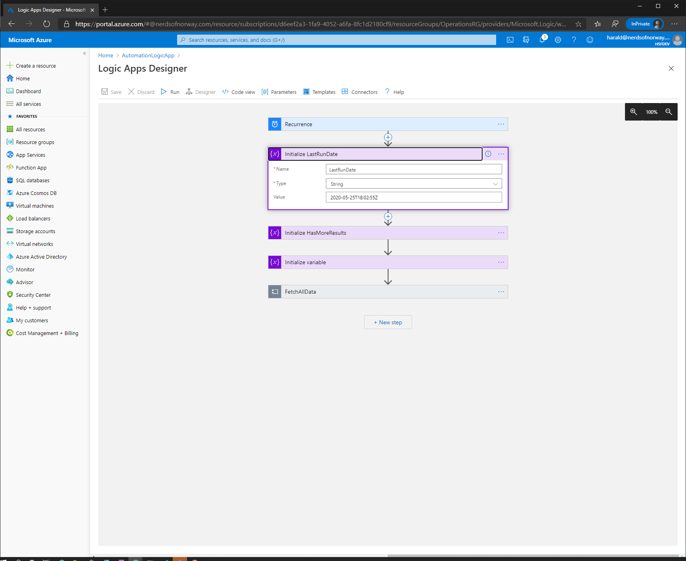

# Azure Lighthouse - Monitor delegation changes in your managing tenant using a Logic App

This example shows how to use a system assigned managed identity with logic apps, in your tenant to monitor delegation changes in order to respond to these events with Low-code and orchestrate more complex workflows or integrate  with your DevOps pipelines to deploy managed solutions.

## Pre-requisites
Make sure you have the rights to create a system assigned identity with the account you are deploying the solution with and privileges to assign the system identity created with the role 'monitoring reader' on root scope (/) - tenant level.

## Steps
 - Click deploy to Azure 
 - Fill inn the name of the resource group, location and the name you'd like on the logic app
 - Navigate to the logic app & click identity 

 

 - Copy the Object-ID as shown above
 - Start Azure Shell (With Powershell)
 - Grant the System assigned identity (object-id) the role 'Monitoring reader'  to '/' (root) scope in your tenant - e.g:

       New-AZRoleAssignment -ObjectId 'OBJECT_ID' -Role 'Monitoring reader' -scope '/'

 - Navigate to the Logic app -> Identity and click assigned roles. Your application should have the role listed for Monitoring reader similar to the image below.

 
 
 - Modify variable 'last run' - to e.g. a date 1 or two days ago (this is just an example to run on-demand and lists changes since parameter)
 
 

 - Run logic app
 - Verify delegation changes 
 - Add custom action to respond to change - using connectors. Some ideas:
    - Update database/cmdb
    - Deploy and provision policies & management structures needed to operate
    - Run Azure DevOps pipeline using SPN having access to new customer to automate process 

